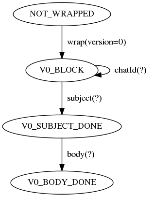

The encoders and decoders that SBE generates in Java (and other languages without approximations of session types) require developers to follow a strict contract:

- Developers must encode/decode all repeating groups and variable-length data fields in the order in which they appear in the schema.
- Developers must explicitly encode/decode/skip all present groups and variable-length data, i.e., no implicit skipping.
- Developers must call next() before encoding/decoding each repeating group element.

When encoding, failure to follow the contract can produce invalid messages that do not conform to the format described in the associated SBE schema.

When decoding, failure to follow the contract can result in the misinterpretation of valid messages.

### Checking field access order

SBE can generate runtime checks that ensure the correct usage of flyweight encoders/decoders/codecs (w.r.t. field access order) in Java, C++ and C#.

To generate these runtime checks, pass `-Dsbe.generate.precedence.checks=true` when running the SBE tool.

By default, the generated checks are disabled, using conditional compilation, as they have a significant performance overhead.
We expect that teams will enable these runtime checks in non-production environments and in their tests.

To enable the runtime checks:

* In Java, set the `sbe.enable.precedence.checks` system property to `true`.
* In C++, define the `SBE_ENABLE_PRECEDENCE_CHECKS` symbol when compiling.
* In C#, define the `SBE_ENABLE_PRECEDENCE_CHECKS` symbol when building.


#### Finer-grained enablement flags, e.g., per schema

The names of the symbols/macros/properties that enable checks may be adjusted by supplying the following system properties to `SbeTool`:

- `sbe.precedence.checks.flagName` controls the symbol/macro used to enable precedence checks at build time in the generated C#/C++ code.
It defaults to `"SBE_ENABLE_PRECEDENCE_CHECKS"`.

- `sbe.precedence.checks.propName` controls the property name used to enable precedence checks at runtime in the generated Java code.
It defaults to `"sbe.enable.precedence.checks"`.

### Checking complete encoding

When runtime checks are enabled, in addition to checking fields are encoded/decoded in the correct order, you can also check that you've fully encoded a message. I.e., that you haven't omitted any groups or variable length fields from the end of the message.
To do so, call the `checkEncodingIsComplete()` method on the flyweight encoder for the message.

### Understanding errors

Once runtime checks are enabled, you may start to see some errors if you have some incorrect (or very unusual) uses of flyweight encoders/decoders/codecs.

For example, if you have a message schema with two variable length fields:

```xml
<sbe:message name="SendChatMessage" id="99">
    <field name="chatId" id="1" type="int64"/>
    <data name="subject" id="2" type="varDataEncoding"/> <!-- subject first -->
    <data name="body" id="3" type="varDataEncoding"/>    <!-- body second -->
</sbe:message>
```

and you accidentally encode these in a different order to the schema:

```java
final SendChatMessageEncoder encoder = new SendChatMessageEncoder()
    .wrapAndApplyHeader(buffer, OFFSET, messageHeaderEncoder);

encoder.chatId(1)
    .body("About 1 ft tall and furry.") // body first
    .subject("Missing cat");            // subject second
```

you will an exception like this one at runtime:

```
Illegal field access order.
Cannot access field "body" in state: V0_BLOCK.
Expected one of these transitions: ["chatId(?)", "subject(?)"].
Please see the diagram in the Javadoc of the inner class #CodecStates.
```

The exception tells us:

- The current codec state is `V0_BLOCK`.
- We cannot call `body` when the codec is in this state.
- But we can call either `chatId` or `subject` in this state.

It also says where we can find more information. The `CodecStates` class documentation holds a dot diagram of the state machine:

```java
    /**
     * The states in which a encoder/decoder/codec can live.
     *
     * <p>The state machine diagram below, encoded in the dot language, describes
     * the valid state transitions according to the order in which fields may be
     * accessed safely. Tools such as PlantUML and Graphviz can render it.
     *
     * <pre>{@code
     *   digraph G {
     *       NOT_WRAPPED -> V0_BLOCK [label="  wrap(version=0)  "];
     *       V0_BLOCK -> V0_BLOCK [label="  chatId(?)  "];
     *       V0_BLOCK -> V0_SUBJECT_DONE [label="  subject(?)  "];
     *       V0_SUBJECT_DONE -> V0_BODY_DONE [label="  body(?)  "];
     *   }
     * }</pre>
     */
    private static class CodecStates
    {
        // ...
    }
 ```

 We can use a tool, e.g., [PlantText](http://planttext.com), to render the dot diagram and reveal the state machine diagram.

 
